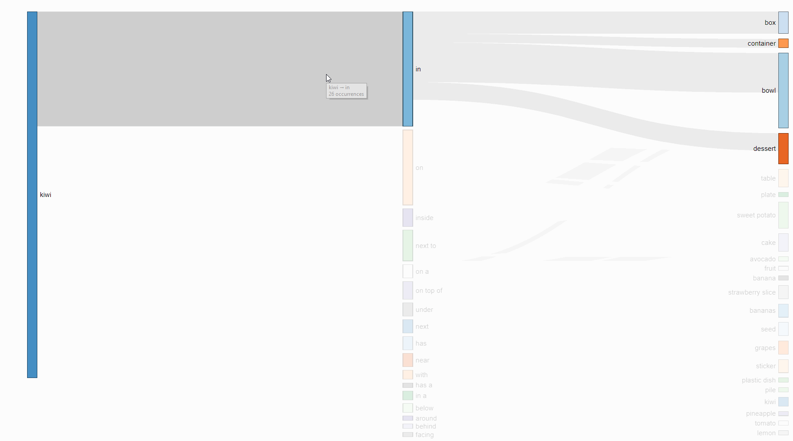

# VG-relations
Visual Genome Relationship Visualization  
Hosted at (Visual Genome Link)

This is a tool for visualizing the frequency of object relationships in the Visual Genome dataset.



It was built with [this d3 Sankey diagram library.](https://github.com/q-m/d3.chart.sankey)

# Data Processing
For this visualization, I tallied up all the relations in all the images in Visual Genome into this JSON format:
```
{
    "subject": {
        "relation": { "object": occurrences }
    }
}
```
Example:
```
{
    "person": {
        "wears": { "backpack": 12, "hat": 10 },
        "eats": { "pizza": 9 }
    },
    "plate": {
        "on": { "table": 5, "placemat": 3 }
    }
}
```
I found this data format interesting as it potentially suggests a method for commonsense inference on visual data using priors from this dataset. For example, 'what kinds of objects usually contain food? → bowls, plates, table'.

# Installation
Clone or download the repository.  
From the main directory run `scripts/setup.sh`. This downloads the data and runs a python script to process it. It's simple enough that Python 2 and 3 should both work.  
Open `explorer.html` in your web browser of choice (I used Chrome).

# Navigation
Type an item into the search bar and hit submit to see relations in which the item was the subject.  
From there, click on any object node to see relationships in which that object was the subject.  
Additionally, click on a subject → relation link to narrow your focus to that relation and show additional objects.

If you found this useful or interesting, feel free to extend the visualization with new functionality, or use the processed data in another interesting way!
